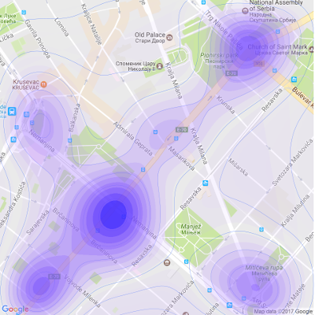

# OpenDataR
Open Data R Notebooks

R notebooks for use cases of http://data.gov.rs open data sets go here.

**Logic:** each folder in this repo = one open data set + its study (Rmd, R, HTML files).

**Content:**

1. **TrafficAccidentsBGD2015** - notebook ODN2017-021, Case Study: Traffic Accidents in Belgrade 2015.
2. **ComInfoPublicImportance** - notebooks ODN2017-02A and ODN2017-02B, Case Study: Commissioner for Information of Public Importance and Personal Data Protection, Republic of Serbia: "Complaints in The Field of Freedom of Information" Data Set 

**Log:**

+ 30 Jan 2017. First case study added: Traffic Accidents in Belgrade 2015. (ODN2017-01)
+ 30 Jan 2017. Open Data R Meetup, Data Science Serbia, Startit Centre Belgrade, Savska 5, 18h.
+ 05 Feb 2017. Second case study, Part A, added: Commissioner for Information of Public Importance and Personal Data Protection, Republic of Serbia: "Complaints in The Field of Freedom of Information" Data Set
+ 12 Feb 2017. Second case study, Part B, added: Commissioner for Information of Public Importance and Personal Data Protection, Republic of Serbia: "Complaints in The Field of Freedom of Information" Data Set

***

**Disclaimer.** The [Open Data Portal of the Republic of Serbia](http://data.gov.rs/sr/) is a young initiative that is currently under development. Neither the owner of this GitHub account as an individual, or [Data Science Serbia](http//www.datascience.rs) as an organization, hold any responsibility for the changes in the URLs of the data sets, or the changes in the content of the data sets published on  the [Open Data Portal of the Republic of Serbia](http://data.gov.rs/sr/). The results of the exploratory analyses and statistical models that are presented on this GitHub account are developed for illustrative purposes only, having in mind the goal of popularization of Open Data exclusively. The owner of this GitHub account strongly advises to consult him (e-mail: [goran.s.milovanovic@gmail.com](mailto:goran.s.milovanovic@gmail.com) and [Data Science Serbia](http//www.datascience.rs) before using the results presented here in public debate or media, and/or for any purposes other than motivating the usage and development of Open Data.  

***
